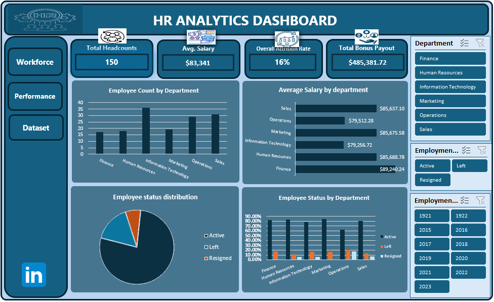
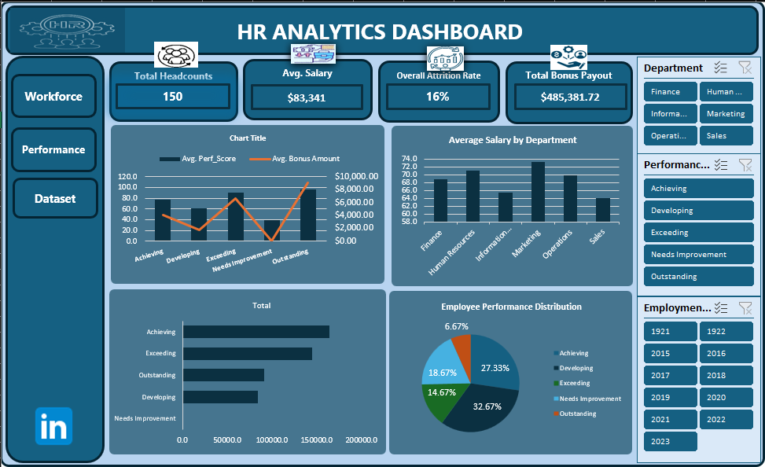

# HR-Analytics---Capstone-Project
# Executive Summary
---
HR Analytics Project built in Microsoft Excel, showcasing data cleaning, advanced Excel formulas, Pivot Tables, and an interactive dashboard for HR analysis. The dashboard provides insights into the organization's workforce of 150 employees, performance, compensation, and attrition rate. The analysis reveals a workforce of 150 employees with an average salary of $83,341 and a 16% overall attrition rate, identifies Operations as the department with the greatest retention challenge, highlights Marketing as the highest-performing department, and demonstrates that the organization's performance-based bonus structure effectively rewards employee performance.

## Dataset Overview
---
The HR dataset contains employee information including:
Employee ID
Employee Name
Department Code
Hire Date
Salary
Performance Score
Employment Status
Department Lookup Table

Upon reviewing the dataset, I observed the following:
The dataset required cleaning and standardization. The following data quality issues were Identified;

- Employee First and Last names were stored in separate columns with missing records in the First_Name columns.

- Departments were represented using department codes rather than department names.

- Some text fields contained inconsistent capitalization (e.g., Department Codes and Employment Status → active, ACTIVE, Actv, LEFT).

- There were unnecessary trailing spaces in some text fields, particularly in department codes.

- Hire dates and Salary values required consistent column formatting.

- Some records had missing Salary values and Performance Scores.

- There were duplicate records in the data.

- Lookup tables were provided separately for Departments and Performance Ratings. 

- Performance bands and bonus percentages needed to be derived from lookup tables.

Exploring the data was necessary to determine the cleaning process to be carried out.

## Data Cleaning Process
Before meaningful analysis could be performed, the following steps were followed to clean the data

Step 1: Removed Duplicate Data
The first step was to check for duplicate employee records to avoid incorrect analysis and misleading insights.
7 records, out of the 157 records were identified as duplicate and removed using the 'Remove Duplicate' feature, leaving us with 150 records to work with. 

Step 2: Corrected data type 

The following column was formatted according to their appropriate data type.
	
	Column:	                Format Applied  
		Hire Date       		Date
		Salary                 Currency
		Performance Score		Number
		Years of Service		Number
		Bonus Amount	        Currency
		
Step 3: Handled Missing Values

- Missing performance scores were replaced using the overall average performance score using →  =Average(G2:G151)

- Missing salary values were replaced using the average salary of the employee's department. This was calculated using the Average IF function 
	→ =AverageIF(C2:C151,HR01,F2:F151).
	
- To handle the mising records in the First Name Column, a new Full_Name column was directly created using the Text Join Function E.g, 		→ =TEXTJOIN(" ",FALSE,B2,C2).
This produced a single full name combing column B2 & C2 while automatically inserting a space between both names and leaving the Last name as the full name for missing records. This was done to avoid fabricating employee information. Combining employing names was also necessary to improve readability and reporting.

Step 4: Standardized Text Values
- Inconsistence text cases in the Department_Code coloumn was resolved using the Upper function. → =UPPER()

- Value field in Employment_status column was handled using the Find & Replace Excel feature. 
Abbreviations and text (e.g., Actv, ACTIVE, LEFT) was standardized to 'Active' and 'Left'.

- Unnecessary trailing spaces in the Full_Name and Department_code Column was handled Using the Trim & Clean function. → =TRIM(CLEAN(C2))

##Data Transformation & Calculated Columns
- Department names were returned from the Lookup table, Using the XLOOKUP Function,
	→ (=XLOOKUP(D2,Lookup_Departments!$A$2:$A$7,Lookup_Departments!$B$2:$B$7,"Invalid Dept_Code",0). 
The department codes served as the look-up value to derive corresponding department names.

- Performance_Band Column was created, using the Ifs Function to categorise employees by performance score range =IFS(G2<=49"Needs Improvement",G2<=69,"Developing",G2<=84"Achieving",G2<=94,"Exceeding",G2<=100,"Outstanding).

- Employees Bonus Percentage was imported from the Department lookup table using XLookup Function.
	→ =XLOOKUP(K8,Lookup_Performance!$C$2:$C$6,Lookup_Performance!$D$2:$D$6,"N/A",0).
	
- Bonus Payout were calculated using Salary * Bonus Percentage.

- Years of Service was calculated From Hire Date using the Dated If functions. 
	→ =DATEDIF(E2,TODAY(),"Y").
	
- The year was extracted from the hire date using;
	=TEXT(Hire Date,"yyyy").

## Challenges Encountered 
- One of the main challenges was dealing with incomplete records. Instead of removing incomplete records—which would have led to incomplete dataset and biased analysis:
I used average imputation where appropriate and only . 
No employee name was fabricated.

- Hidden spaces and varying text cases initially affected lookup results, but applying the TRIM, CLEAN, and PROPER functions resolved these issues.
  
- Inconsistent Date format; After formatting cell as Date using the DD/MM/YY format, some date cell was still showing error, 
This was resolved by changing the location entirely following thestep → 'Cell Format' → Date → Change Located → Date Type to DD/MM/YYYY to maintain consistency. 

- Another challenge encountered was calculating the attrition rate by department using Pivot Tables. 
Excel did not directly calculate the percentage of employees with a "Left" status against the total number of employees in each department. To overcome this, all employee status categories (Active, Left, and Resigned) were included in the Pivot Table and the values were displayed as % of Row Total. This allowes to identify the percentage of employees with a "Left" status for each department, which represented the departmental attrition rate (e.g., Operations: 20.69%, Finance: 17.65%, Marketing: 15.79%).

→	Microsoft Excel Tools Used for Analysis
- Pivot Tables
- Pivot Charts
- Slicers
- XLOOKUP
- IFS
- DATEDIF
- TEXTJOIN
- AVERAGEIF
- TRIM & CLEAN
- Conditional Formatting

# DashBoard & Insights
---
## Overall Workforce Analysis Insights

- The company employs 150 people across all six departments with an average salary of $83,341.

- Information Technology is the largest department, while Finance is the smallest. 

- Finance offers the highest average salary, whereas Information Technology and Operations have lower average salaries despite having some of the largest workforces.

- Based on the Employee Status Distribution, the analysis shows that the workforce remains largely stable, with 77.33% of employees currently active. Operations experiences the highest employee turnover, with only 62.07% of employees remaining active. An overall attrition rate of 16% was recorded based on employees who have left the organization, while 6.67% resigned voluntarily.

-Approximately 77% of employees remain active, demonstrating a healthy workforce stability.

→	By Department
-Operations recorded the highest resignation rate (17.24%) and one of the highest employee exit rates (20.69%), indicating a potential retention concern.

-Marketing has one of the healthiest workforce retention rates, with over 84% of employees remaining active.

-Finance reports no resignations, although some employees  left the organization.

-Most departments maintain active employee rates above 77%, indicating generally healthy workforce stability

-The workforce distribution indicates that organizational resources are concentrated in operational and technical functions, while compensation remains relatively balanced across departments.

## Performance Analysis Insights

The organization's average performance score is 68.1, indicating that employee performance is generally satisfactory across all departments. Most employees fall within the Developing and Achieving performance bands, suggesting that while many employees are meeting expectations, there is still room for performance growth.

-The average score suggests that most employees fall within the Achieving and Developing performance categories.
→	Average Performance Score by Department
						
						Department					Average Performance Score
						Marketing					73.2
						Human Resources 			71.0
						Operations					69.9
						Finance 					68.9
						Information Technology		65.4
						Sales						64.1

- This shows that Marketing records the highest average performance score, making it the overall best-performing department, followed by Human Resources.
  
- Sales records the lowest average performance score, indicating a greater need for performance improvement initiatives.
  
- The relatively small variation in scores across departments suggests that employee performance is fairly consistent throughout the organization.

→	Employee Performance Distribution
				
				Performance Band:		Percentage
				Developing:				32.67%
				Achieving:				27.33%
				Needs Improvement:		18.67%
				Exceeding:				14.67%
				Outstanding:			6.67%

- The largest performance group falls in the in the Developing category.
  
27.33% of employees are Achieving, indicating that a significant proportion are meeting performance expectations.
  
Only 6.67% of employees are rated Outstanding, suggesting opportunities to develop more high-performing talent.

18.67% of employees fall under Needs Improvement, highlighting the need for targeted coaching and employee development.

- The organization projects a total bonus payout of $485,381.72, with bonuses awarded based on employee performance.

        Performance Band    	Total Bonus
            Achieving			$164,690.80
			Exceeding			$144,880.50
			Outstanding		    $91,326.24
			Developing			$84,484.20
			Needs Improvement	$0.00

→	Departmental Bonus Analysis
- Despite not having the highest average performance score, Information Technology receives the highest bonus payout because it has the largest workforce.

- Marketing delivers the strongest overall performance, while Sales records the lowest average performance score.

# Recommendation
---
Operations should be prioritized for retention initiatives due to its significantly higher turnover and resignation rates.

Strengthen performance coaching in Sales by introducing regular feedback sessions, mentoring, and targeted training to improve employee performance.

Recognize and retain high-performing employees by continuing to reward Exceeding and Outstanding performers while creating career development opportunities to sustain high performance.

Review departmental workforce and bonus allocation, particularly in Information Technology, to ensure bonus expenditure continues to align with both workforce size and performance outcomes.

Adopt best practices from Marketing and Human Resources, the highest-performing departments, and replicate successful performance management strategies across other departments.
